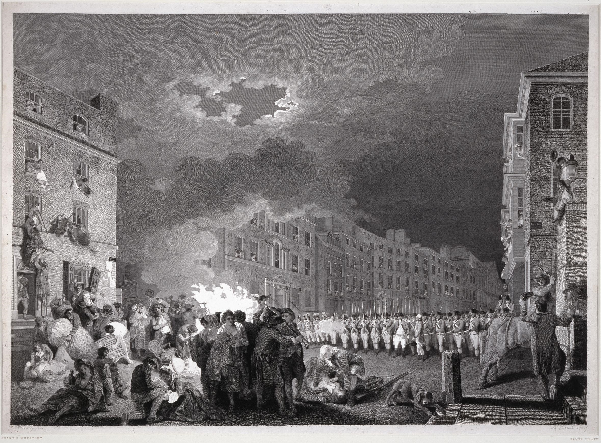

### Conflict in the eighteenth-century British Empire

<figure>
     
    <figcaption>The riot in Broad Street on 7 June, 1780, engraving by James Heath after a painting by Francis Wheatle, <a href="https://commons.wikimedia.org/wiki/File:Heath_after_Wheatley_-_Gordon_Riots_1780.jpg">Wikimedia Commons</a></figcaption>
</figure>

This repository contains metadata analyses and visualisations relating to different types of public conflict in the eighteenth-century British Empire.

1) [Chronological table of events (classified)](https://monikabarget.github.io/Revolts/event-table.html)

2) [Map of events (British Isles and overseas colonies)](https://monikabarget.github.io/Revolts/event-map.html)

3) [Map of rebellion sermon publication](https://monikabarget.github.io/Revolts/sermons.html)

4) <a href="https://monikabarget.github.io/Revolts/overviews.html">Overviews of British and colonial media production</a>

5) <a href="https://monikabarget.github.io/Revolts/overviews.html">Tagged vocabulary extracted from eighteenth-century publications</a>

All data and visualisations published in this repository can be shared and re-used under a <a href="https://creativecommons.org/licenses/by/2.0/">CC-BY license</a>. Updates and corrections are welcome. Static maps and charts based on the data will subsequently be published in print.

[CONTACT](https://monikabarget.github.io/Revolts/contact.html)
