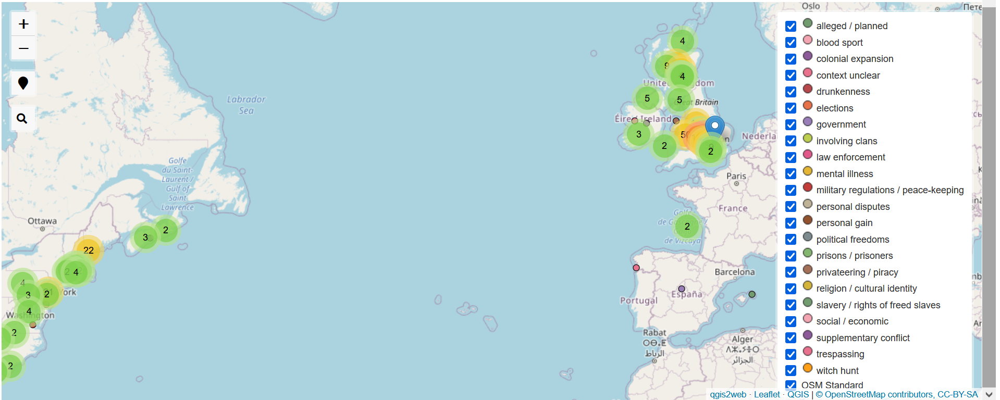

### Interactive map of uprisings

The **interactive map** below is based on events of violent protest (including planned and alleged uprisings) found in print-publications of the eighteenth century as well as Wikidata and Wikipedia. In order to show that many regions of 18th-century conflict had also been affected by unrest in previous centuries, events between 1500 and 1800 have been mapped. The zoomable map in this repository displays the event names and more detailed location information in pop-up labels. Although displayed as point geometries, some events affected larger areas. The colour gradation reflects the progression of time: more distant events are shown in darker colours. When zooming in, more events in the selected area become visible. On the top-level, the events are clustered:

Event descriptions (especially information on their outcomes) have mainly been harvested from the **Wikipedia info boxes** and need to be checked carefully in the future. The details can be viewed when <a href="https://github.com/MonikaBarget/Revolts/blob/master/MAP_events.geojson">clicking on individual points in the underlying GeoJSON file</a>.

Different **types of events** (e.g. uprisings related to economic grievances, uprisings concerned with individuals freedoms, or uprisings aimed at a change of government) have been marked in the corresponding [data table](https://github.com/MonikaBarget/Revolts/blob/master/TABLE_events_1513-1819.csv). This tagging of events is necessarily subject to an interpretation and simplification of the insurgents' motives and discussed in the print publication. Although the data are thus far from complete, they showcase the geographic distribution of violent conflict across the early modern British Empire as well as the many overlaps between regional, "inner-state" events and conflicts involving foreign agents.

