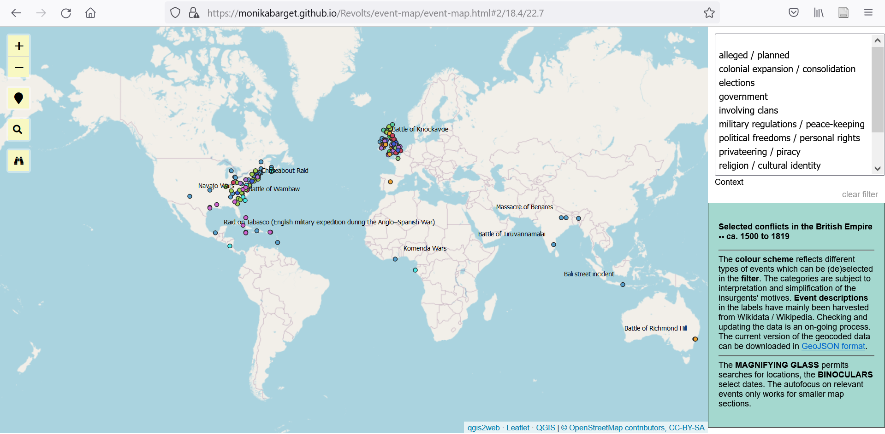

### Interactive map of uprisings

The **interactive map** below is based on events of violent protest (including planned and alleged uprisings) found in print-publications of the eighteenth century as well as Wikidata and Wikipedia. In order to show that many regions of 18th-century conflict had also been affected by unrest in previous centuries, events between 1500 and 1800 have been mapped. The zoomable map in this repository displays the approximate location of events and provides additional information in **pop-up labels**. Although displayed as point geometries, some events affected larger areas (see place details in label). The **colour gradation** from blue to yellow reflects the progression of time: more distant events are shown in darker colours. When zooming in, more events in the selected area become visible:

Event descriptions (especially information on their outcomes) have mainly been harvested from the **Wikipedia info boxes** and need to be checked carefully in the future. The details can be viewed when <a href="https://github.com/MonikaBarget/Revolts/blob/master/MAP_events.geojson">clicking on individual points in the underlying GeoJSON file</a>.

Different **types of events** can be selected from the interactive legend on the right and are based on my own tagging in the corresponding [data table](https://github.com/MonikaBarget/Revolts/blob/master/TABLE_events_1513-1819.csv). This tagging of events is necessarily subject to an interpretation and simplification of the insurgents' motives.
For instance, unrests in Ireland has either been tagged as social / economic, relating to political freedoms, or government-related although religion also played a part. The rationale behind these categorisations is further discussed in the print publication. The purpose of this mapping effort is to showcase the geographic distribution of violent conflict across the early modern British Empire as well as the many overlaps between regional events and conflicts involving agents in several parts of the Empire as well as on the European continent.

