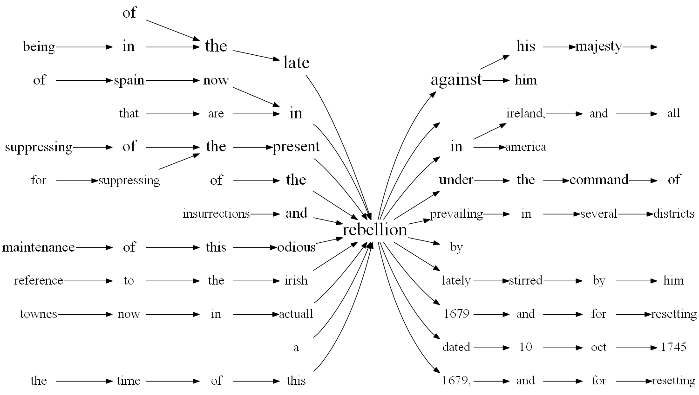
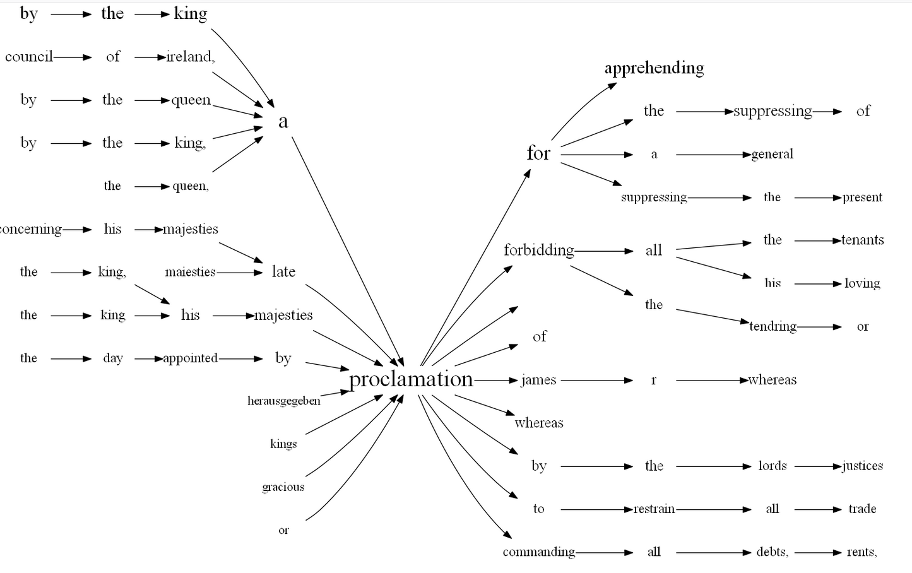
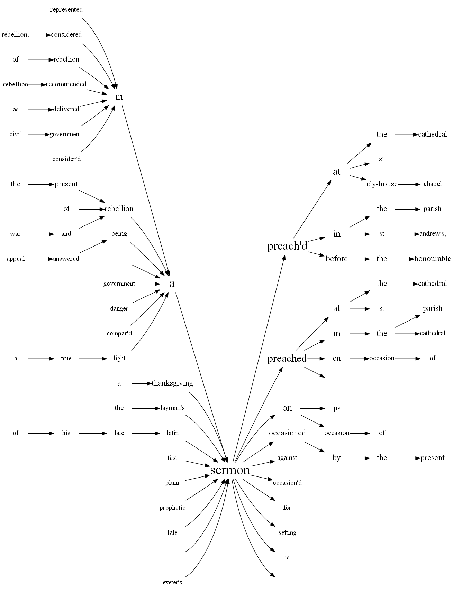
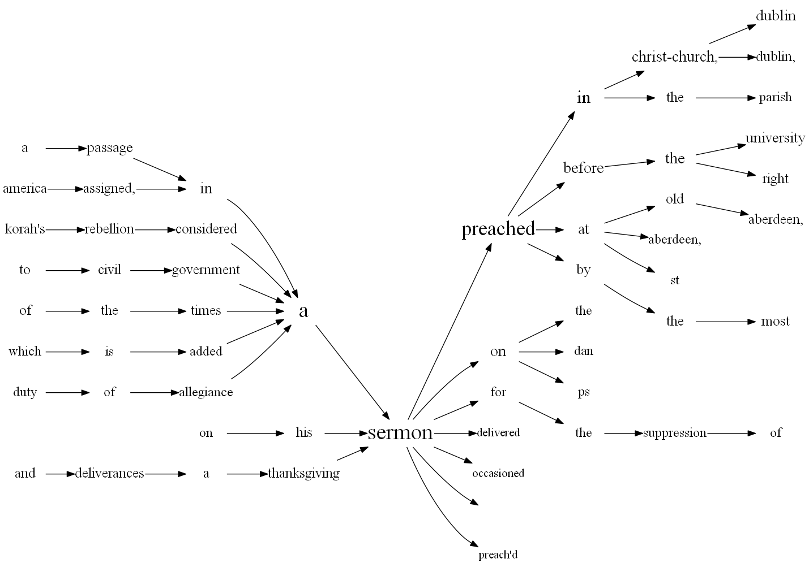

## Narrative structures / sermons

Word trees are a form of visualising narrative structures in text sources. The word trees below show common structures in publication titles relating to uprisings of the eighteenth century in Britain and the colonies. The word trees were created with Python. 

### "Rebellion" in context

This word tree shows the context in which the word "rebellion" often appeared in publications of all genres.

<figure>

<figure/>
  
### (Royal) proclamations

This word tree represents titles of (royal) proclamations on rebellions.
  
<figure>

<figure/>
  
### Sermon titles

These two word trees visualise titles of printed sermons in two timeframes:

a) published between 1684 and 1750
  
<figure>

<figure/>
  
b) published between 1750 and 1800
  
<figure>

<figure/>
