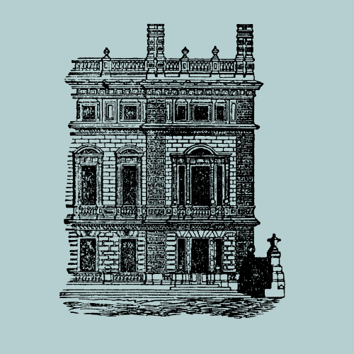

**Related publications:**

Barget, Monika. ‘The Agreeable Contrast - British Caricatures of the 1745 Jacobite Rebellion’. In: New Approaches to Religion and the Enlightenment, edited by Brett McInelly and Paul Kerry. Vancouver, British Columbia: Fairleigh Dickinson University Press, 2018.

———. ‘“Hired mobs” – öffentliche Meinung und gesteuerte Menge im frühneuzeitlichen Großbritannien’. In: Jenseits der Ordnung? Zur Mächtigkeit der Vielen in der Frühen Neuzeit, edited by Rudolf Schlögl and Jan Marco Sawilla, 45-74 (56 Normseiten). Berlin: Neofelis, 2019.

———. ‘Power and Identity’. In: Cultural History of Color: Enlightenment, 1650-1800, edited by Carole Biggam and Kirsten Wolf, 1st ed., 4:59–72. The Cultural History Series. London / New York: Bloomsbury Academic, 2021. https://www.bloomsbury.com/uk/a-cultural-history-of-color-9781474273732/.

Barget, Monika, and Nóra G. Etenyi. ‘The International Reputation and Self-Representation of Hungarian Noblemen in the 17th Century’. In: Political Violence in Early Modern Imagery, edited by Malte Griesse, Monika Renate Barget, and David de Boer, 54:165–97. Brill’s Studies on Art, Art History, and Intellectual History. Leiden: Brill, 2021. https://brill.com/view/title/60088.
