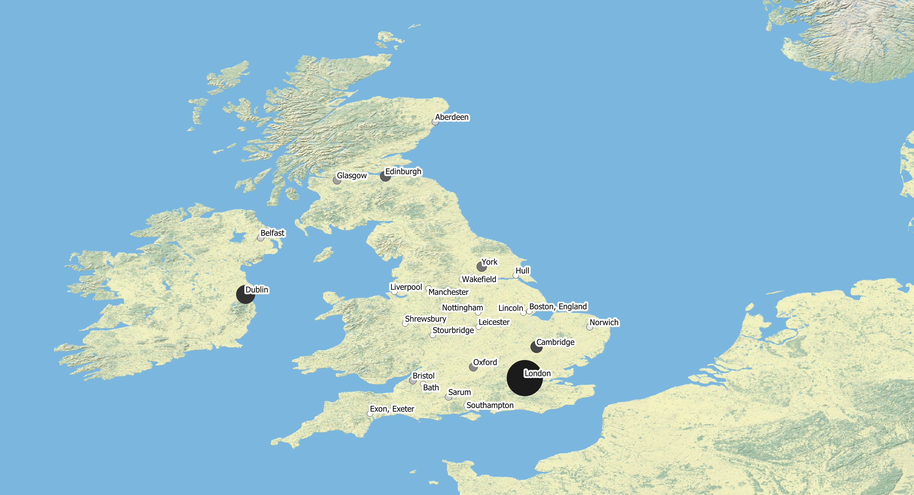

### Visualisation of rebellion sermons

Zoomable map of places in the British Isles where anti-rebellion sermons between 1684 and 1800 were printed (based on metadata extracted from WorldCat):

  
Click [here](https://github.com/MonikaBarget/Revolts/blob/master/MAP_sermons-per-place.geojson) to download and re-use the GeoJSON file.

