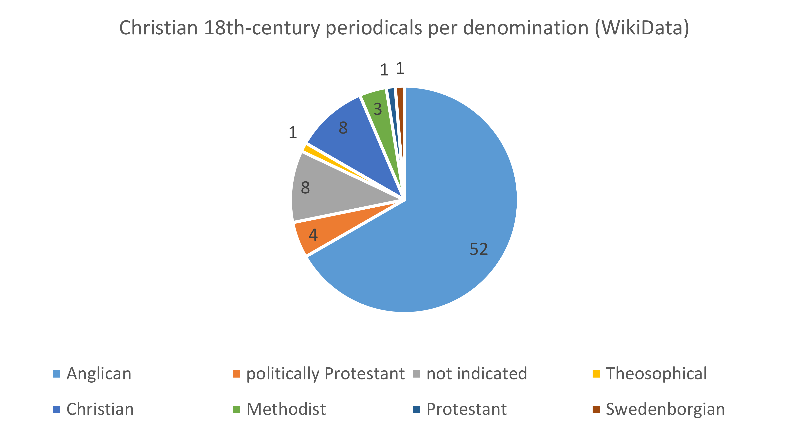
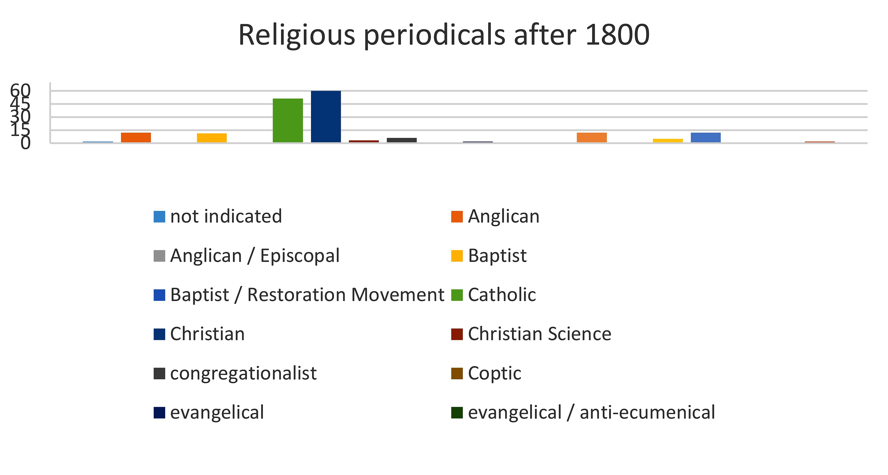

<h2>Sermons and religious periodicals</h2>

<h3>Visualisation of rebellion sermons</h3>

Zoomable map of places in the British Isles where anti-rebellion sermons between 1684 and 1800 were printed (based on metadata extracted from JISC and WorldCat):

  

Click <a href="https://github.com/MonikaBarget/Revolts/blob/master/GeoJSON_map_layers/Sermons_Oct2022.geojson">here</a> to download and re-use the GeoJSON file (last updated in October 2022).

<h3>Frequently mentioned preachers</h3>

The following chart shows the most frequently mentioned names of preachers in the collected metadata. The removal of duplicate sermons will need to continue. Also, many authors of (mock) sermons used pseudonyms or published their works anonymously.

<h3>Chronological table of religious periodicals</h3>

The following table lists religious periodicals published in Britain and the colonies between 1600 and 1800. Please use the slider at the bottom to scroll right and see the additional information on publication dates, publication places and denominational affiliations. The table is fully searchable. Keywords can be entred in the search box in the top-left corner of the table:

<a href="https://github.com/MonikaBarget/Revolts/blob/master/TABLE_religious-periodicals.csv">Searchable table of religious periodicals published between 1600 and 1800</a>

English-language Christian periodicals first published before 1800 by denomination (data from Wikidata, Samuel J. Rogal's 1971 paper <a href="https://doi.org/10.14713/jrul.v35i1.1522">‘Religious Periodicals in England During the Restoration and Eighteenth Century’</a> and the 'The New Cambridge Bibliography of English Literature', edited by George Watson, Vol. 2: 1600-1800. Cambridge: Cambridge University Press, 1971):

English-language Christian periodicals first published after 1800 by denomination (data from Wikidata and the 'The New Cambridge Bibliography of English Literature', edited by George Watson, Vol. 2: 1600-1800. Cambrdige: Cambridge University Press, 1971):

